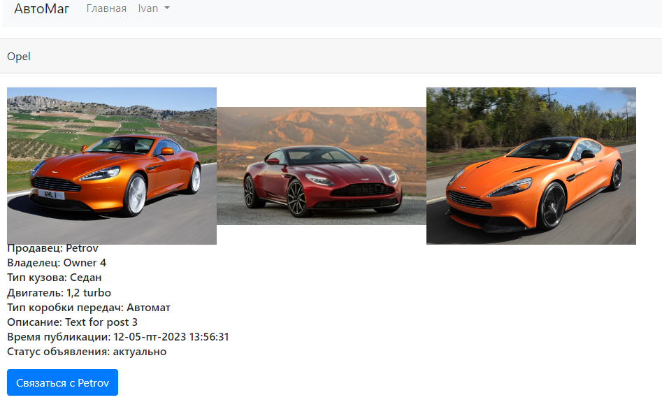

# job4j_cars

### Описание проекта:
Приложение представляет собой сайт по продаже автомобилей. 
В приложении реализованы функции:
- регистрация, редактирование пользователя;
- добавление, редактирование и просмотр объявлений;
- время создания объявлений отображается с учетом часового пояса авторизованного пользователя;
- объявления содержат информацию об автомобиле, такую как:
    - модель автомобиля; 
    - тип кузова;
    - тип трансмиссии;
    - двигатель;
    - фотографии;
    - информация о владельце;
    - редактирование истории владения автомобилем.
- объявления имеют статус активное\закрытое (закрытые не отображаются в общем поиске);
- добавление владельца в БД;
- фильтры для поиска по основным характеристикам автомобилей.


### Применяемые технологии: 
- Spring boot 2.7.4;
- Thymeleaf;
- Bootstrap 4;
- Hibernate 5.6.11;
- PostgreSql 12;
- Lombok 1.18.22
- Liquibase 4.15.0;
- H2 2.1.214;
- jQuery 3.4.1.

### Требования к окружению: 
- Java 17;
- Maven 3.8;
- PostgreSQL 12.

### Запуск проекта:
- Настроить окружение и подключение к серверу БД.
- Создать базу данных, например через утилиту psql:
``` 
create database cars
``` 
- Упаковать проект в jar архив. Для этого выполнить:
``` 
mvn package
```
- Запустить приложение командой:
```
java -jar job4j_cars-1.0.jar
```

### Взаимодействие с приложением:
* Страница авторизации ...*


* Страница регистрации ...*


*Стартовая страница ...*


*Только объявления пользователя ...*


*Фильтры поиска объявлений ...*


*Отображение объявления ...*



*Страница с информацией о продавце ...*


*Создание нового объявления ...*


*Страница добавления владельца ...*


*Редактирование объявления ...*


---

### Контакты
email: [ivan.turutin@gmail.com](mailto:ivan.turutin@gmail.com)